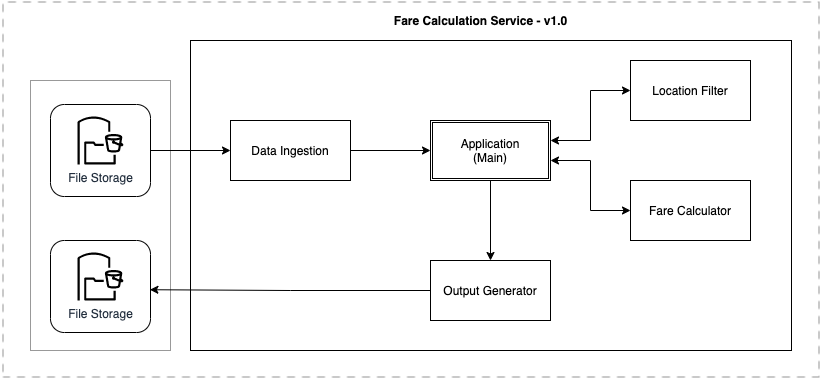

# Fare Calculation Service #

Demonstration of Requirements understanding, proposing a solution and implementation by using the latest tools and techniques.

---

## Distribution ##
- A Dockerized `maven` application.
- **[Sonar Project](https://sonarcloud.io/dashboard?id=naeemark_fcs)** - **Bonus Requirement**

---

### What is this repository for? ###

* This app is built as assignment for Beat - NL.
* Adds different libs to enhance the application quality and performance.
* CI/CD Demonstration using [Github Actions](https://github.com/features/actions)
* Docker containers are used for Packaging and execution
* Version 1.0.0

---

### Problem Statement:
- Provide a solution to estimate ride fares as per the provided scenarios.

---
### Proposed Solution:

- By keeping the provided instructions in mind, I would prefer to build a Java application for the implementation of required functionality.
- For unit testing, I would prefer to use JUnit and Mockito.

### Architecture Diagram

#### Services
- **Data Ingestion**: Responsible for reading the input data
- **Location Filtration**: Responsible for sanitization of locations of rides
- **Fare Calculator**: Responsible to calculate the fare as per the provided instructions
- **Application**: A main class to perform the end to end functionality

### Development Cycle:
- Distributes the whole development into Small tasks
- [Each Issue](https://github.com/naeemark/fare-calculation-service/issues?q=is%3Aissue) shows a feature
- [Each commit](https://github.com/naeemark/fare-calculation-service/commits/main) shows a small progress
- [Pull Requests](https://github.com/naeemark/fare-calculation-service/pulls?q=is%3Apr+is%3Aclosed) are done for major tasks

## How do I get Run? ##

### How to set up
To set-up locally the project locally you need to clone this repo, from `main` branch or some latest `TAG`

### Configuration
- Please sync and resolve the `maven` dependencies
- Run `mvn clean install`
- To run tests `mvn clean test`

### Using Docker Compose
- `docker-compose up --build` will do the magic for you, you may skip `--build` after the first time
- [Docker-compose](docker-compose.yaml) file includes required parameter of sample input in `command` section
  - For testing purpose, provide sample data is also included in repo
    - [Input Data](data/paths.csv)
    - [Output Data](data/paths.csv.output)
- After the execution the docker container will be stopped.

### How the Solution Works
- **A:** Docker compose command leads to invoke the `Application::main()` along with the arguments containing path to input data file.
- **B:** At first step, the application reads the `locations` data from the provided CSV
- **C:** Secondly, same service is called again to split the `locations-data-list` into smaller, as per the rideIds of locations.
- **D:** On the next stage, another service is invoked, which performs a full sanitization on all the ride location lists, and it also adds calculated attributes(i.e duration, speed, distance) to the Models to avoid re-processing.
- **E:** Now the next service is used to calculate the faire for each step/location for every ride.
- **F:** Lastly, the estimated fare is written to an output file in same directory of input along with respective rideId.

### Pre-reqs
- JDK 1.8
- Docker
- Junit
- IntelliJ IDEA

### Tools Included
- Jacoco
- Sonar
- Github Actions

## External Tools: ##

- **[Github Actions](https://github.com/features/actions)**
- **[Docker](https://www.docker.com/)**
- **[Docker Compose](https://docs.docker.com/compose/)**
- **[SonarCould](https://sonarcloud.io/)**
